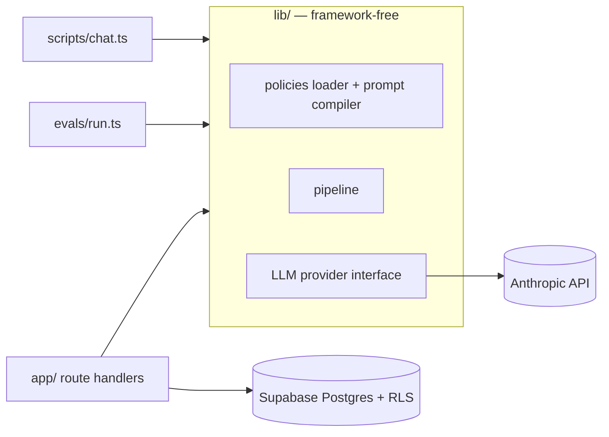
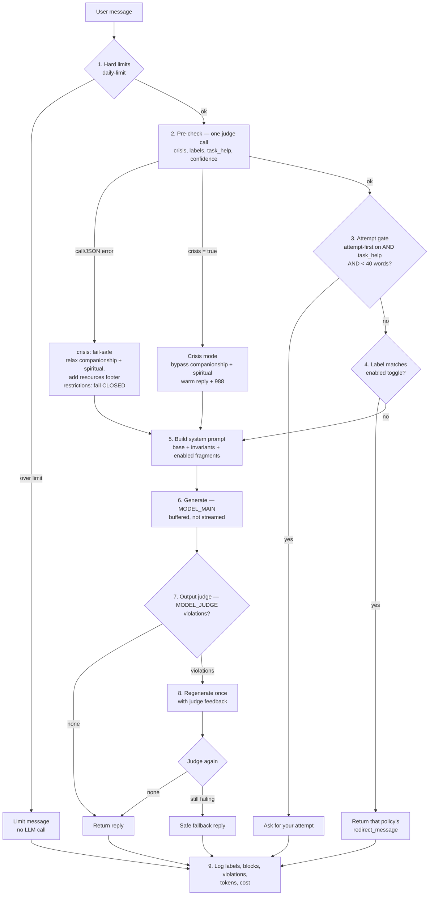

# Architecture

## Layout

```
policies/        Toggle definitions as Markdown + YAML frontmatter (the product)
lib/             Framework-free core — never imports Next.js
  pipeline/      The message pipeline (pure, testable)
  config/        Env + pricing config
scripts/chat.ts  Terminal adapter  (npm run chat)
evals/           Eval harness adapter (npm run eval)
app/             Next.js web adapter (Phase 4+)
supabase/        SQL migrations + RLS (Phase 4+)
docs/            ARCHITECTURE, DECISIONS, LEARNING
```

The core is called by three adapters — CLI, evals, web — so it can't depend on any one of them.



## The message pipeline

One judge call before generation handles both the crisis check and classification
(see DECISIONS D2). Different fields fail in different directions.



## Enforcement hierarchy

From strongest to weakest. A toggle is only as strong as its strongest layer.

| Layer | Strength | Why |
|---|---|---|
| App code (daily-limit, attempt gate, cooling-off) | Unbreakable | No model is involved; there is nothing to argue with |
| Input classifier | Strong | Runs before generation; the user's text is data being labeled, not instructions being followed |
| Output judge | Strong | Inspects what was actually produced, regardless of how the user got there |
| System prompt | Weak | The model reads it alongside the user's text, and a clever user can argue with it |
